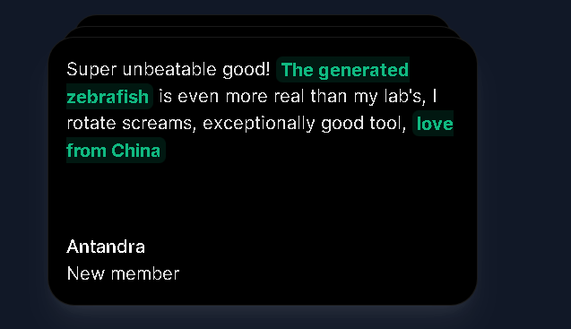

This is a ApexIntel, project which is connected to several AI providers such as OpenAI and models from Replicate. Thanks to these providers, the user can both interact with the AI bot and generate images, short videos, music and code. However, generation is limited to 30 free generations. In order to get unlimited generation, one needs to purchase a premium..

## Getting Started

First, open this link which redirect you to the landing page [https://apex-intel.vercel.app/](https://apex-intel.vercel.app/). Then click the "Get Started" button which will redirect you to the SignIn form.

After successful login you will be redirected to the Dashboard page where you will find all the sections for generating content.

## Generating Content
You can start communicating with the OpenAI gpt-3.5 model about anything you want. 

Furthermore, this page can offer you to generate not only one image, but even five images in different qualities. 

Generate multi-second videos and music. 

And the last thing I can offer you is the generation of the code itself in any language. Just write what you want to generate and in what language it should be and within seconds you have your code generated. 
For example:

When you reach the free generation limit you wont be able to generate more content without buying subscription. You can easily buy it when you click on Upgrade button below Generation limit progress bar.

Thank you for using ApexIntel, I hope you like it. If you have any questions or need help, please contact me via crisp support.